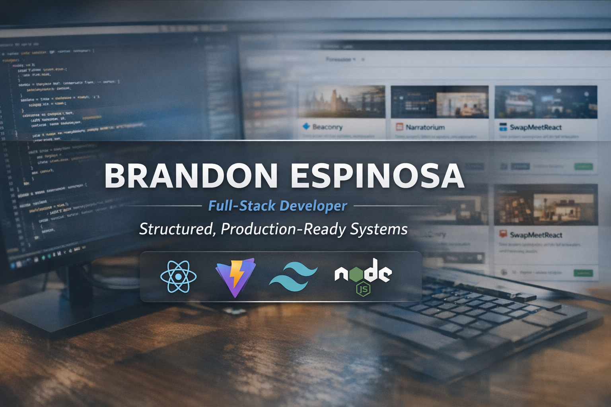

# Brandon Espinosa — Portfolio

> I build complete, production-ready systems — not just features. This portfolio includes 5 deployed full-stack applications with real authentication, database design, and live user workflows.

---

## 🚀 Live Portfolio

🔗 **View Portfolio:** https://espinosa-portfolio-ed7cbcfe5cfd.herokuapp.com/

🔗 **GitHub:** https://github.com/espinbrandon49  

---

## 🧭 Overview

This portfolio is a curated collection of completed full-stack applications, each designed to demonstrate real-world functionality, clean architecture, and end-to-end execution.

Every project included here is **fully built, deployed, and functional** — not a prototype.

---

## 🧠 Development Philosophy

- Build **complete systems**, not fragments  
- Emphasize **clarity, structure, and maintainability**  
- Design for **real users and real workflows**  
- Prioritize **production-ready execution over experimentation**

---

## 🛠️ Tech Stack

**Core Technologies**
- React
- Node.js
- Express
- MongoDB/Mongoose
- MySQL/Sequelize
- PostgreSQL/SQLAlchemy

**Additional Tools & Libraries**
- Socket.io (real-time systems)
- Express Session / JWT (authentication)
- Axios (API client)
- Vite
- Tailwind CSS
- React Router
---

## 📦 Featured Projects

### 🔷 Beaconry
Real-time broadcast system for structured, one-way communication with subscription-scoped delivery.

**Highlights**
- Role-based access control (broadcaster vs subscriber)
- Subscription-scoped feed delivery
- Invite-based channel access
- Session-based authentication

🔗 Live: https://beaconry-5423965f3fe8.herokuapp.com/  
🔗 GitHub: https://github.com/espinbrandon49/Beaconry  

---

### 📖 Narratorium
Collaborative storytelling platform with real-time editing and token-based contribution mechanics.

**Highlights**
- Real-time collaborative editing
- Token-based contribution system
- Structured narrative progression
- Custom themed UI/UX

🔗 Live: https://narratorium-e41b5a6a7718.herokuapp.com/  
🔗 GitHub: https://github.com/espinbrandon49/narratorium-enchanted  

---

### 🛒 SwapMeetReact
Marketplace platform for listing, browsing, and purchasing items across categorized shops.

**Highlights**
- Category-based product browsing
- Shop and listing management
- Cart and checkout flow
- RESTful backend architecture

🔗 Live: https://swapmeetreact.netlify.app/  
🔗 GitHub: https://github.com/espinbrandon49/Swap-Meet-React  

---

### ✍️ Hack-A-Thought
Structured blog platform with emphasis on clean data modeling and content organization.

**Highlights**
- Canonical data modeling
- Full CRUD operations
- Structured post organization
- Tailwind-based UI

🔗 Live: https://hack-a-thought-473618422e58.herokuapp.com/  
🔗 GitHub: https://github.com/espinbrandon49/Hack-A-Thought  

---

### 🌍 GlobeMaster
Interactive quiz application with persistent data tracking and structured gameplay logic.

**Highlights**
- Database-driven question system
- Session tracking and scoring
- Backend validation (no client-side answers)
- Full-stack integration

🔗 Live: https://globemaster-bcaf42abf3ef.herokuapp.com/  
🔗 GitHub: https://github.com/espinbrandon49/globemaster  

---

## ⚙️ Local Development

```bash
npm install
npm run dev
```

---

## 📬 Contact

- 📧 Email: espinbrandon49@gmail.com  
- 💼 GitHub: https://github.com/espinbrandon49  
